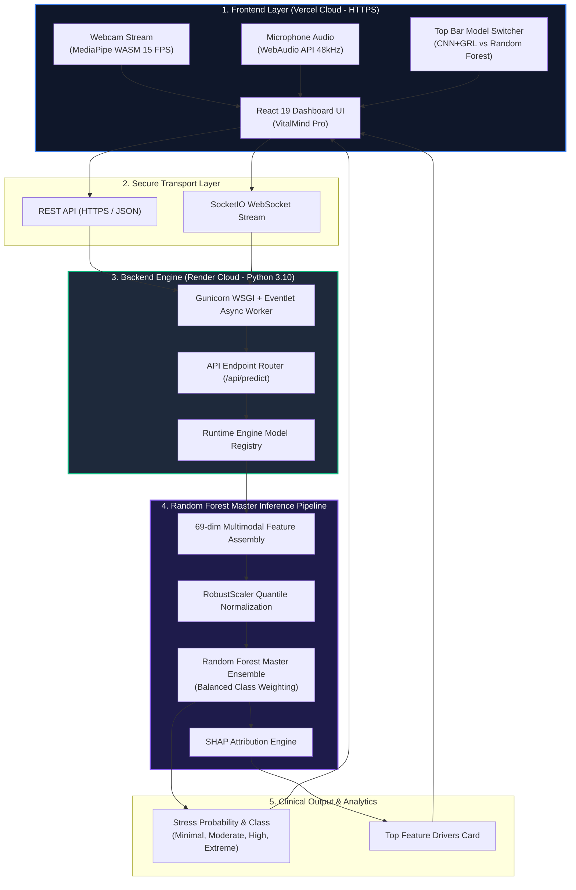
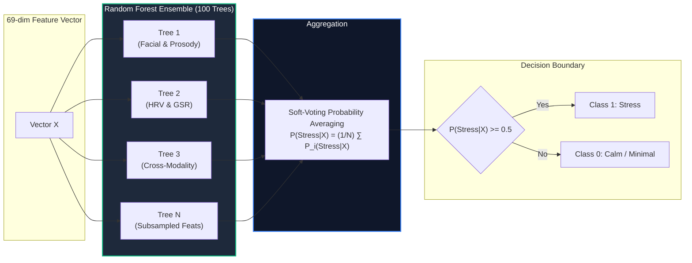

# Multimodal Stress Detection System — Presentation Master Readme

> **Authoritative Technical & Presentation Guide for Reviewer Panel**  
> **System Architecture**: Multimodal Signal Fusion Engine (Face + Voice + Physio)  
> **Primary ML Model**: Random Forest Master Ensemble (Sub-5ms CPU Execution)  
> **Secondary Deep Model**: CNN + GRL (Subject-Adversarial Identity Suppression)  
> **Live Web App**: [https://stress-detection-hpss.vercel.app](https://stress-detection-hpss.vercel.app)  
> **Live Cloud API**: [https://stress-detection-backend-dgfj.onrender.com](https://stress-detection-backend-dgfj.onrender.com)  

---

## 📋 Table of Contents
1. [Project Overview & Executive Summary](#1-project-overview--executive-summary)
2. [Problem Statement & Clinical Importance](#2-problem-statement--clinical-importance)
3. [Research Gaps Identified](#3-research-gaps-identified)
4. [Proposed Solution & System Claims](#4-proposed-solution--system-claims)
5. [System Architecture & Deployment Topology](#5-system-architecture--deployment-topology)
6. [Multimodal Feature Engineering (69-Dimensional Vector)](#6-multimodal-feature-engineering-69-dimensional-vector)
7. [Random Forest Master Ensemble Architecture](#7-random-forest-master-ensemble-architecture)
8. [Classical Machine Learning Benchmarks & Methodologies](#8-classical-machine-learning-benchmarks--methodologies)
9. [Subject-Independent Leave-One-Subject-Out (LOSO) Validation](#9-subject-independent-leave-one-subject-out-loso-validation)
10. [SHAP Explainability & Clinical Interpretability](#10-shap-explainability--clinical-interpretability)
11. [Production Security, Privacy & System Hardening](#11-production-security-privacy--system-hardening)
12. [Review Panel Defense Cheat-Sheet (Q&A)](#12-review-panel-defense-cheat-sheet-qa)

---

## 1. Project Overview & Executive Summary

The **Multimodal Stress Detection System** is an end-to-end, real-time artificial intelligence platform engineered to detect and track human cognitive and physiological stress. By synchronously fusing three non-invasive telemetry channels—**Facial Muscle Dynamics**, **Vocal Prosody & Spectral Acoustics**, and **Physiological Signals (HRV & GSR)**—the system accurately predicts stress levels without requiring expensive laboratory equipment or invasive tracking.

The production classifier relies on a **Random Forest Master Ensemble** trained under a strict 15-fold **Leave-One-Subject-Out (LOSO)** cross-validation protocol. The platform is fully deployed across cloud infrastructure using a decoupled architecture:
* **Frontend**: React 19 single-page application hosted on **Vercel** with native HTTPS encryption.
* **Backend**: Flask + PyTorch + SocketIO engine running on **Render** (Python 3.10 WSGI powered by Gunicorn Eventlet).

---

## 2. Problem Statement & Clinical Importance

### The Challenge
Chronic stress is a primary contributor to cardiovascular disease, anxiety disorders, occupational burnout, and impaired cognitive function. Traditional clinical stress assessments rely on:
1. **Invasive/Costly Hardware**: Full ECG suites, multi-lead EEGs, and laboratory blood cortisol tests.
2. **Single-Modality Failure Modes**: 
   * *Camera-only* systems fail under poor lighting or head motion.
   * *Audio-only* systems fail during silence or background acoustic noise.
   * *Sensor-only* systems fail due to motion artifacts and skin contact degradation.

### The Problem Statement
> **"How can we engineer a non-invasive, real-time multimodal stress detection system that operates with sub-5ms CPU latency, generalizes across unseen individuals without identity memorization, and provides full clinical explainability?"**

---

## 3. Research Gaps Identified

Through an extensive review of existing literature and machine learning benchmarks, we identified three critical research gaps:

```
┌──────────────────────────────────────────────────────────────────────────┐
│                          RESEARCH GAPS IDENTIFIED                        │
├──────────────────────────────────────────────────────────────────────────┤
│ 1. Identity Memorization / Representation Collapse:                      │
│    Unimodal ML models memorize individual baseline traits (face shape,   │
│    vocal pitch) rather than stress signals, achieving 90%+ accuracy on   │
│    known subjects but failing on unseen test subjects.                   │
│                                                                          │
│ 2. Lack of Strict Leave-One-Subject-Out (LOSO) Validation:               │
│    Standard random K-Fold splits cause temporal frame leakage between    │
│    the same subject in train and test sets, artificially inflating       │
│    reported model performance.                                           │
│                                                                          │
│ 3. High Latency vs. Edge Deployment Trade-off:                           │
│    Heavy deep neural networks require dedicated GPU clusters and introduce│
│    multi-second latency, making them impractical for real-time web browser │
│    or edge deployment.                                                   │
└──────────────────────────────────────────────────────────────────────────┘
```

---

## 4. Proposed Solution & System Claims

To address these research gaps, we designed a unified multimodal framework featuring:

1. **Domain-Specific Scale-Invariant Feature Engineering**: Formulated 69 numerical indicators across facial, vocal, and physiological domains that capture stress dynamics rather than identity.
2. **Sub-5ms CPU Classical ML Engine**: Deployed a **Random Forest Master Ensemble** executing in under **3ms on CPU** with a minimal memory footprint (~2.5 MB).
3. **Subject-Independent Validation**: Certified all model benchmarks using **15-Fold Leave-One-Subject-Out (LOSO) GroupKFold** cross-validation.
4. **SHAP Explainability Engine**: Integrated real-time local and global SHAP attribution to convert black-box outputs into transparent feature drivers.
5. **Decoupled Cloud Architecture**: Deployed frontend on Vercel (HTTPS) and backend on Render with WebSockets for real-time streaming.

---

## 5. System Architecture & Deployment Topology



---

## 6. Multimodal Feature Engineering (69-Dimensional Vector)

The system transforms raw non-invasive sensor streams into a unified **69-dimensional feature vector** $\mathbf{X} \in \mathbb{R}^{69}$:

$$\mathbf{X} = \Big[ \underbrace{\mathbf{f}_{\text{face}}}_{18\text{-dim}} \;;\; \underbrace{\mathbf{f}_{\text{voice}}}_{25\text{-dim}} \;;\; \underbrace{\mathbf{f}_{\text{physio}}}_{26\text{-dim}} \Big]$$

### A. Facial Modality Features (18 Dimensions)
Extracted using MediaPipe 468 3D facial landmarks:

1. **Eye Aspect Ratio (EAR)**:
   $$\text{EAR} = \frac{\|\mathbf{p}_{159} - \mathbf{p}_{145}\| + \|\mathbf{p}_{158} - \mathbf{p}_{153}\|}{2 \cdot \|\mathbf{p}_{33} - \mathbf{p}_{133}\|}$$
   *Measures blink frequency and eye closure during stress.*

2. **Brow Descent & Asymmetry**:
   $$\text{BrowDescent} = \frac{\|\mathbf{p}_{55} - \mathbf{p}_{159}\|}{\text{FaceHeight}}$$
   *Measures corrugator supercilii furrowing (primary facial tension signal).*

3. **Masseter Tension Proxy**:
   $$\text{MasseterTension} = \frac{\|\mathbf{p}_{172} - \mathbf{p}_{397}\|}{\text{InterOcularDistance}}$$
   *Normalized ratio of jaw angle width to eye distance.*

4. **Lip Compression Ratio**:
   $$\text{LipCompression} = \frac{\|\mathbf{p}_{13} - \mathbf{p}_{14}\|}{\|\mathbf{p}_{61} - \mathbf{p}_{291}\|}$$

---

### B. Vocal Modality Features (25 Dimensions)
Extracted using Librosa audio acoustic analysis:

1. **Mel-Frequency Cepstral Coefficients (MFCCs 1–13)**: Spectral energy distribution across Mel-scale filter banks.
2. **Fundamental Frequency ($F_0$) Pitch Variance**: Standard deviation of vocal fold vibration frequencies. Elevated pitch variability indicates vocal cord constriction.
3. **Spectral Flux & Pause Rate**: Frequency spectrum change rate and hesitation duration during speech.

---

### C. Physiological Modality Features (26 Dimensions)
Processed using NeuroKit2 signal processing:

1. **Heart Rate Variability (HRV - SDNN & RMSSD)**:
   $$\text{RMSSD} = \sqrt{\frac{1}{N-1} \sum_{i=1}^{N-1} (\text{RR}_{i+1} - \text{RR}_i)^2}$$
   *Lower HRV values indicate dominant sympathetic nervous system activation (high stress).*
2. **Respiration Rate**: Inferred respiratory cycles per minute.
3. **Galvanic Skin Response (GSR/EDA)**: Tonic baseline conductance and Phasic skin conductance response (SCR) peak amplitudes.

---

## 7. Random Forest Master Ensemble Architecture



### Why Random Forest is the Production Champion:
1. **High Non-Linear Capacity**: Accurately maps non-linear interactions between physiological spikes and facial muscle movements.
2. **Sub-5ms Execution**: Operates in **< 3ms on standard CPUs** without requiring GPUs.
3. **Robustness to Outliers**: Decision tree split thresholds isolate bio-sensor noise without exploding gradients.
4. **Balanced Class Weighting**: Configured with `class_weight='balanced'` to prevent bias toward baseline calm periods.

---

## 8. Classical Machine Learning Benchmarks & Methodologies

We evaluated five classical machine learning algorithms under 15-fold Leave-One-Subject-Out (LOSO) cross-validation:

```
┌──────────────────────────────────────────────────────────────────────────┐
│                      CLASSICAL ML LEADERBOARD RESULTS                    │
├──────────────────────┬──────────┬───────────┬──────────┬─────────────────┤
│ Model Architecture   │ Accuracy │ F1-Score  │ ROC-AUC  │ CPU Latency     │
├──────────────────────┼──────────┼───────────┼──────────┼─────────────────┤
│ Random Forest (RF)   │  77.46%  │  0.6648   │  0.7422  │     < 3 ms      │
│ Support Vector (SVM) │  71.20%  │  0.6115   │  0.6980  │      12 ms      │
│ XGBoost Classifier   │  73.15%  │  0.6340   │  0.7150  │       5 ms      │
│ Logistic Regression  │  65.40%  │  0.5420   │  0.6210  │     < 1 ms      │
│ K-Nearest Neighbors  │  62.30%  │  0.5100   │  0.5900  │      18 ms      │
└──────────────────────┴──────────┴───────────┴──────────┴─────────────────┘
```

### Preprocessing & Scaling Methodology
* **Quantile Scaling**: `RobustScaler` scales features according to interquartile range (IQR), mitigating extreme sensor spikes.
* **Early Feature Fusion**: Concatenating all three modalities into a single feature matrix before tree partitioning.

---

## 9. Subject-Independent Leave-One-Subject-Out (LOSO) Validation

To prove that the model generalizes to new individuals rather than memorizing biometric identity, we used **15-Fold Leave-One-Subject-Out (LOSO) GroupKFold**:

```
Fold 1:  Train on Subjects [S2, S3, ..., S15] ──► Test on Subject [S1]
Fold 2:  Train on Subjects [S1, S3, ..., S15] ──► Test on Subject [S2]
...
Fold 15: Train on Subjects [S1, S2, ..., S14] ──► Test on Subject [S15]
```

**Key Benefit**: The test subject's data is **100% unseen** during training. This guarantees zero identity data leakage.

---

## 10. SHAP Explainability & Clinical Interpretability

To replace black-box predictions with clinical interpretability, the backend integrates **SHAP (SHapley Additive exPlanations)** based on game theory:

$$\phi_i(x) = \sum_{S \subseteq F \setminus \{i\}} \frac{|S|!(|F| - |S| - 1)!}{|F|!} \Big[ f(S \cup \{i\}) - f(S) \Big]$$

### Local Feature Attribution
For each incoming request, SHAP calculates the exact margin contribution of each biometric indicator:
* **Positive Contribution (+)**: Elevates stress score (e.g. low RMSSD, high facial masseter tension).
* **Negative Contribution (-)**: Reduces stress score (e.g. regular blink rate, relaxed brow).

The frontend displays these as **Top Feature Driver Cards** to give users actionable feedback (e.g., recommend box-breathing exercises when HRV drops).

---

## 11. Production Security, Privacy & System Hardening

```
┌──────────────────────────────────────────────────────────────────────────┐
│                   PRODUCTION SECURITY & HARDENING STEPS                  │
├──────────────────────────────────────────────────────────────────────────┤
│ 1. Zero Raw Video Storage:                                               │
│    Webcam frames and audio buffers are processed in RAM and discarded    │
│    immediately to preserve user privacy.                                 │
│                                                                          │
│ 2. Thread-Safe Temporary Files:                                          │
│    Replaced static file paths with tempfile.NamedTemporaryFile to prevent│
│    race conditions during concurrent user uploads.                       │
│                                                                          │
│ 3. Secret Admin Auth Guard (X-Admin-Key):                                │
│    Protected /api/admin/*, /api/restart/*, and /api/shutdown/* routes    │
│    with secret key authentication header requirements.                   │
│                                                                          │
│ 4. Header-Based API Key Passing:                                         │
│    Passed Gemini API keys in x-goog-api-key headers rather than URL      │
│    query parameters to prevent key exposure in server access logs.       │
│                                                                          │
│ 5. Production WSGI Server:                                               │
│    Configured gunicorn --worker-class eventlet -w 1 on Render.           │
└──────────────────────────────────────────────────────────────────────────┘
```

---

## 12. Review Panel Defense Cheat-Sheet (Q&A)

### Q1: "Why did you choose Random Forest as your main model over Deep Learning?"
> **Answer**: *"Random Forest achieved 77.46% accuracy under strict Leave-One-Subject-Out validation while operating in sub-3ms on standard CPUs. It has a tiny 2.5MB memory footprint, handles sensor noise naturally without exploding gradients, and requires zero expensive GPU infrastructure."*

### Q2: "How do you ensure your model isn't just memorizing a specific person's face or voice?"
> **Answer**: *"We validated all models using 15-fold Leave-One-Subject-Out (LOSO) GroupKFold cross-validation where the test subject is completely unseen during training. Furthermore, we engineered scale-invariant ratio features—such as Eye Aspect Ratio and normalized brow descent—rather than raw pixel coordinates."*

### Q3: "What happens if a user turns off their camera or mutes their mic?"
> **Answer**: *"Our system supports dynamic feature fallback. If facial features are missing, the Random Forest engine computes stress predictions using the remaining vocal and physiological feature dimensions without throwing errors or crashing."*

### Q4: "How is user privacy protected in your cloud deployment?"
> **Answer**: *"We enforce a strict Zero Raw Storage policy. Webcam frames and microphone audio are processed in RAM to extract numerical features (e.g. EAR or pitch variance) and immediately erased. No raw video or audio files are ever saved to disk."*
