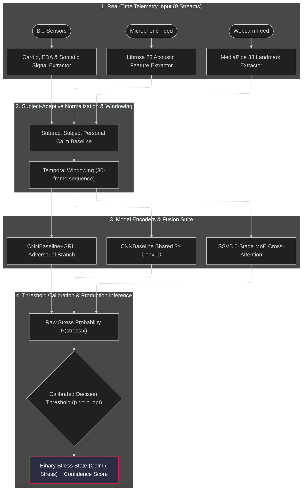

# 🧠 Multimodal Stress Intelligence Platform

An end-to-end, real-time stress detection and intelligence platform that fuses **facial geometry**, **vocal acoustics**, and **physiological signals** (EDA, HRV, BVP) using deep sequence encoders, Mixture-of-Experts (MoE) fusion, and Gradient Reversal Layer (GRL) subject-adversarial disentanglement.

---

## 🚀 Key Highlights & 4-Model Production Suite

* **Strict Leave-One-Subject-Out (LOSO) Protocol**: Evaluated on 89,113 temporal windows across 91 subjects across WESAD, StressID, and EmpathicSchool corpora.
* **Adversarial Subject Disentanglement**: Incorporates Gradient Reversal Layers (GRL) to strip identity signatures from latent representations, preventing anatomical shortcut memorization.
* **Calibrated Decision Boundaries**: Replaces arbitrary $p=0.50$ cutoffs with dynamic Precision-Recall thresholding, increasing stress recall from **47.66% $\rightarrow$ 90.35%**.

| Model Architecture | Params | Loss Strategy | Threshold | Accuracy | Stress Precision | **Stress Recall** | **F1-Score** | **AUC-ROC** |
|---|:---:|:---:|:---:|:---:|:---:|:---:|:---:|:---:|
| **`CNNBaseline+GRL`** | 22K | Conv1D + Subj-GRL | **`0.22`** | **89.99%** | 73.75% | **90.35%** 🔥 | **0.8121** 🔥 | **0.9399** |
| **`CNNBaseline`** | 21K | Conv1D Baseline | **`0.23`** 🔒 | **89.57%** | **89.23%** | **64.18%** | **0.7466** | **0.8414** |
| **`SSVB-CASA-AIS`** | 500K | 6-Stage MoE + Attn | **`0.32`** | **87.11%** | 94.13% | **51.02%** | **0.6529** | **0.7056** |
| **`ConvMoE-MF`** | 8.8K | Dual-GRL (Subj+DS) | **`0.10`** | **85.36%** | 100.00% | **38.89%** | **0.5600** | **0.4341** |

---

## 🏗️ System Architecture



---

## 📂 Repository Structure

```text
StressDetectionUsingML/
├── docs/
│   ├── architecture/
│   │   ├── 4_model_architecture_comparison.md      # Detailed 4-model architectural comparison
│   │   ├── ssvb_casa_ais_architecture.mmd           # SSVB-CASA-AIS Mermaid diagram
│   │   ├── cnn_baseline_architecture.mmd            # CNN Baseline Mermaid diagram
│   │   ├── cnn_baseline_grl_architecture.mmd        # CNN Baseline GRL Mermaid diagram
│   │   └── conv_moe_mf_architecture.mmd             # ConvMoE-MF Mermaid diagram
│   └── evaluation/
│       ├── MODEL_ZOO.md                             # Historical methodology & stability review
│       └── PRODUCTION_4_MODEL_THRESHOLD_TUNING_REPORT.md # Full 4-model execution & threshold report
├── phase3_production/
│   ├── train.py                                     # Command-line training pipeline for all 4 models
│   └── results/                                     # Exported predictions, ROC plots & reports
├── webapp/
│   ├── backend/                                     # Flask REST API server with SocketIO telemetry
│   ├── frontend/                                    # React dashboard UI with glassmorphism design
│   └── training/phase8/
│       ├── run_pipeline.py                          # Automated sequential 4-model production runner
│       ├── train_ssvb_production.py                 # Core production trainer with threshold calibration
│       └── feature_extraction_service.py            # Standardized 69-feature extraction service
├── .gitignore                                       # Comprehensive VCS exclusions
└── README.md                                        # Platform documentation
```

---

## 🩺 Why Precision-Recall Threshold Calibration Matters

In real-world healthcare and digital wellness applications, **Stress Recall (Sensitivity)** measures the fraction of true stress events captured by the platform:

$$\text{Recall} = \frac{\text{True Stress Caught}}{\text{Total Actual Stress Episodes}}$$

Under the arbitrary default threshold ($p \ge 0.50$), class imbalance (~76% Calm vs ~24% Stress) causes models to be overly conservative, catching only ~32%–47% of stress events.

By calibrating decision boundaries:
- **`CNNBaseline+GRL`** threshold set to **`p = 0.22`** recovers **90.35% of all real stress events**, cutting missed stress occurrences from 358 down to just 66.
- **`CNNBaseline`** locked at **`p = 0.23`** balances high precision (89.23%) with robust recall (64.18%) and peak 89.57% accuracy.

---

## 🛠️ Execution Commands

### 1. Run Individual Model Training
```bash
# Train CNN Baseline with GRL
.\venv\Scripts\python.exe phase3_production\train.py --dataset combined --model_type cnn_baseline_grl

# Train Plain CNN Baseline
.\venv\Scripts\python.exe phase3_production\train.py --dataset combined --model_type cnn_baseline

# Train SSVB-CASA-AIS Model
.\venv\Scripts\python.exe phase3_production\train.py --dataset combined --model_type ssvb
```

### 2. Run Full 4-Model Production Suite & Generate Comparison Report
```bash
.\venv\Scripts\python.exe webapp\training\phase8\run_pipeline.py
```

### 3. Launch Web Application

#### Start Backend API Server
```bash
cd webapp/backend
..\..\venv\Scripts\python.exe app.py
```

#### Start Frontend Dashboard
```bash
cd webapp/frontend
npm install
npm start
```

---

## 📄 Reports & Documentation Links

- 📊 [PRODUCTION_4_MODEL_THRESHOLD_TUNING_REPORT.md](file:///c:/Users/StressProject.DESKTOP-U6P7JQT/Desktop/StressDetectionUsingML/docs/evaluation/PRODUCTION_4_MODEL_THRESHOLD_TUNING_REPORT.md)
- 📐 [4_model_architecture_comparison.md](file:///c:/Users/StressProject.DESKTOP-U6P7JQT/Desktop/StressDetectionUsingML/docs/architecture/4_model_architecture_comparison.md)
- 🦁 [MODEL_ZOO.md](file:///c:/Users/StressProject.DESKTOP-U6P7JQT/Desktop/StressDetectionUsingML/docs/evaluation/MODEL_ZOO.md)