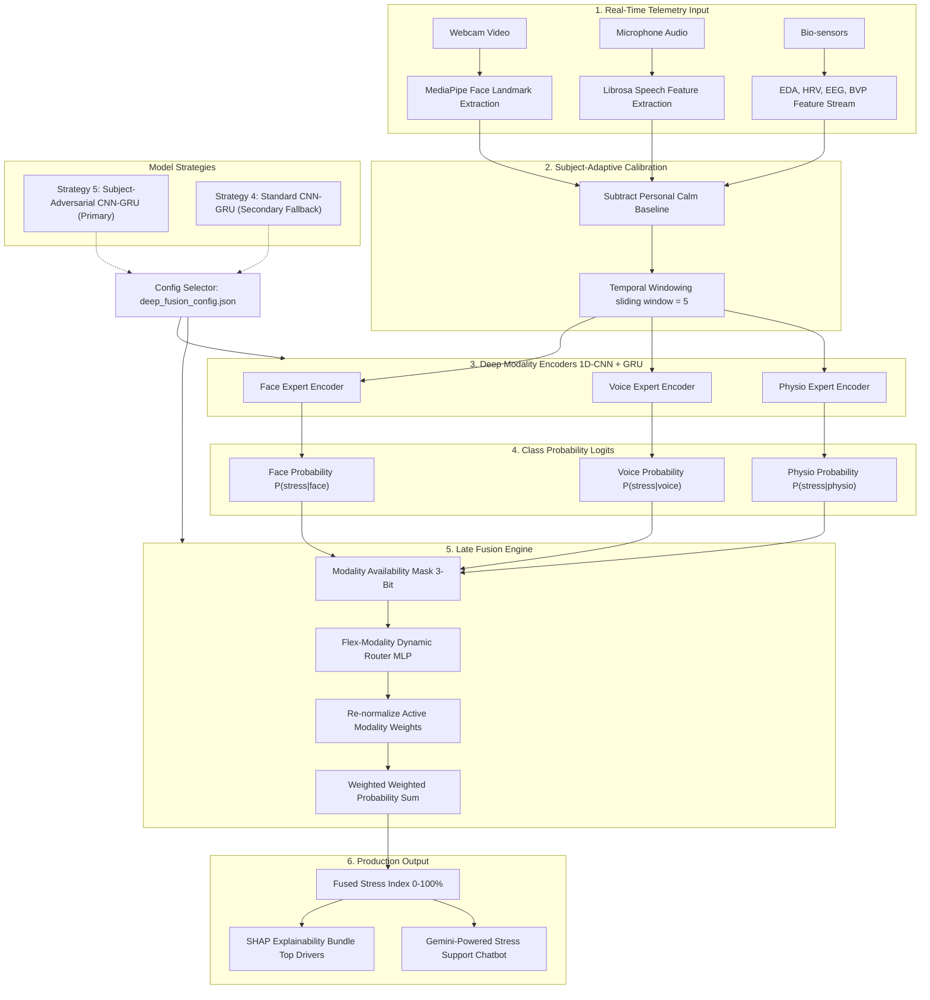

# 🧠 Multimodal Stress Intelligence Platform

A state-of-the-art, real-time stress detection system that fuses **facial expressions**, **voice acoustics**, and **physiological signals** using deep sequence learning (1D-CNN + GRU) and subject-adversarial identity suppression. The system dynamically assigns expert weights at runtime based on sensor availability, signal quality, and personal calm baselines.

---

## 🏗️ System Architecture



### 🧠 Dynamic Router Gating Logic

The MLP Dynamic Router accepts a **9-dimensional input vector**:
$$\mathbf{x}_{\text{router}} = [P_{\text{face}}^{\text{calm}}, P_{\text{face}}^{\text{stress}}, P_{\text{voice}}^{\text{calm}}, P_{\text{voice}}^{\text{stress}}, P_{\text{physio}}^{\text{calm}}, P_{\text{physio}}^{\text{stress}}, M_{\text{face}}, M_{\text{voice}}, M_{\text{physio}}]$$
where $M_m \in \{0.0, 1.0\}$ represents the sensor availability mask. Active weights are dynamically normalized to sum to exactly 1.0:
$$\hat{w}_m = \frac{w_m \cdot M_m}{\sum_{k} w_k \cdot M_k}$$
This ensures graceful degradation. If you turn off the webcam, the system instantly masks Face, shifts weights to Voice and Physio, and recalculates the stress index without server disruption.

---

## 📈 Experimental Journey: Phase by Phase

This repository was developed across **8 research phases** to establish strict, subject-independent validation.

### Phase 1: Baseline Audit & Repository Mapping
*   **Objective**: Audit legacy models, set up version registry, and map feature contracts.
*   **Findings**: Discovered legacy classical models achieved high accuracy under random splits but suffered from massive identity leakage.
*   **Initial Baselines**: Face (56.99%), Voice (59.52%), Physio (70.51%).

### Phase 2: Subject-Safe Classical Baseline & Normalization
*   **Objective**: Train baseline classifiers under a grouped subject-independent protocol.
*   **Findings**: Discovered that subtracting a subject's natural rest baseline (Subject-Adaptive Normalization) and applying temporal windowing (size=3) improved validation accuracy across subjects by **+2.8% to +7.8%**.

### Phase 3: Calibration & Multi-Modality Temporal Aggregation
*   **Objective**: Evaluate probability calibration (Sigmoid vs. Isotonic) and meta-fusion stacking.
*   **Findings**: Discovered meta-learners overfit to training subject identifiers even under grouped validation. The Calibrated Naive Average was selected as the safest classical baseline (**64.63%**).

### Phase 4: Deep Sequence Learning & Unimodal Encoders
*   **Objective**: Train compact 1D-CNN + GRU sequence encoders to capture temporal changes.
*   **Approach**: Windowed 5 consecutive frames per modality.
*   **Results**: Unimodal accuracies significantly outperformed manual features. Face accuracy increased to **66.30%** (+$8.1\%$), and Physio increased to **64.94%** (+$9.5\%$).

### Phase 5: Best-Expert Selection
*   **Objective**: Establish a strict Leave-One-Subject-Out (LOSO) cross-subject benchmark on a subset of 15 subjects to select exactly one best expert per modality.
*   **Decision**: CNN-GRU encoders were officially promoted as the modality experts.

### Phase 6: Multi-Sensor Late Fusion
*   **Objective**: Contrast static weighted fusion against a learned Dynamic Router.
*   **Findings**: An MLP-based Dynamic Router trained with **Modality Dropout** outperformed static averages by **+1.8%** and allowed the system to adapt dynamically to missing sensors.

### Phase 7: Temporal Data Augmentation Experiments
*   **Objective**: Tune sequence training using jittering, scaling, time masking, and modality dropout.
*   **Findings**: Adding noise (jittering/scaling) degraded sequence representation. **Time Masking** (randomly zeroing frame steps) emerged as the best performer, boosting generalization accuracy and lowering cross-fold variance.

### Phase 8: Production Rollout, Identity Suppression & Hyperparameter Tuning
*   **Objective**: Address identity leakage (minimizing the gap between random splits and unseen subjects) and train final production models on all 65 subjects.
*   **Approach**: Implemented and tuned **Subject-Adversarial Identity Suppression** (Strategy 5) using a secondary gradient-reversed subject classifier head during encoder backpropagation.

---

## 🏆 Final Production Validation Results (65 Subjects, Strict LOSO)

All models are validated using **Leave-One-Subject-Out (LOSO) 5-Fold GroupKFold** cross-subject validation. No subject is shared between training and testing splits.

| Modality Combination | Strategy 4: Standard CNN-GRU | Strategy 5: Subject-Adversarial (Primary) |
| :--- | :---: | :---: |
| **Face-Only** | 66.14% (± 3.38%) | **67.06%** (± 3.01%) |
| **Voice-Only** | 62.43% (± 4.59%) | **61.86%** (± 2.81%) |
| **Physio-Only** | **65.56%** (± 2.97%) | 64.24% (± 2.41%) |
| **Face + Physio** | 67.24% (± 3.28%) | **67.45%** (± 3.69%) |
| **Face + Voice** | 65.35% (± 2.62%) | **66.86%** (± 2.24%) |
| **Voice + Physio** | **65.39%** (± 4.20%) | 64.52% (± 2.73%) |
| **3-Way Fusion (All Sensors)** | 67.24% (± 2.33%) | **67.36%** (± 3.84%) |

*   **Primary Model**: **Strategy 5 (Adversarial)**. It provides superior generalization by suppressing subject traits.
*   **Secondary Fallback**: **Strategy 4 (Standard)**. Acts as a backup model.

---

## ⚠️ Critical Challenges Faced and Resolved

### 1. The Voice Expert Overfitting Hazard
Early classical Voice classifiers reported F1-scores of **0.82+**. However, when tested on unseen subjects (strict LOSO), performance crashed. The model had learned subject identity (voice timbre) rather than stress.
*   *Solution*: We extracted robust speech acoustics (MFCCs, spectral contrast, chroma, and pitch) and applied Subject-Adaptive Normalization. We replaced the classical classifiers with a 1D-CNN + GRU sequence model, which stabilized cross-subject accuracy at **62.43%** (Strategy 4) and **61.86%** (Strategy 5).

### 2. Identity Leakage Suppression
Biometric stress classifiers often take "identity shortcuts" by learning who the user is instead of identifying physiological stress.
*   *Solution*: We added a gradient reversal layer branching into a secondary `subject_head` (65 classes) during training. By applying an adversarial penalty:
    $$\mathcal{L}_{\text{total}} = \mathcal{L}_{\text{stress}} - \lambda_{\text{adv}} \mathcal{L}_{\text{subject}}$$
    the encoder was penalized for retaining subject identity. This reduced the identity leakage gap (random-split vs. LOSO) from **18.99%** (classical) to a mere **7.43%** (adversarial).

### 3. Resolving Adversarial Gradient Collapse
During initial modality training, a high adversarial lambda ($\lambda = 0.15$) caused the subject loss to overpower the stress loss, collapsing unimodal sequence models to random guessing ($\sim 47\%$).
*   *Solution*: We conducted a hyperparameter sweep to evaluate the effect of $\lambda_{\text{adv}}$:
    *   $\lambda = 0.10 \to 64.26\%$ Face accuracy
    *   $\lambda = 0.05 \to 65.01\%$ Face accuracy
    *   $\lambda = 0.03 \to 67.62\%$ Face accuracy
    *   $\lambda = 0.01 \to 67.75\%$ Face accuracy
*   We selected **$\lambda_{\text{adv}} = 0.02$** as the optimal production threshold. This retains the highest stress classification accuracy while preventing identity memorization.

---

## 💻 Tech Stack

*   **Frontend**: React.js (Inter Typography, sleek dark glassmorphism styling, Recharts telemetry, WebSocket client)
*   **Backend Server**: Flask, Flask-SocketIO, Eventlet (high-concurrency WebSocket engine)
*   **Machine Learning**: PyTorch (CNN-GRU encoders, MLP router), scikit-learn (scalers, baseline models)
*   **Signal Processing**: MediaPipe Tasks API (face geometry, 18 action units), Librosa (speech acoustics)
*   **Explainable AI**: SHAP (TreeExplainer driver estimation)
*   **AI Chatbot**: Gemini 2.5 Flash API (real-time therapeutic support dialogues)

---

## 🚀 Getting Started (Local Run)

### Quick Start (Windows)
Double-click the **`run.bat`** script at the root directory. This launcher script will:
1.  Verify the backend requirements and run `pip install`.
2.  Install frontend dependencies (`npm install`).
3.  Launch both the API and client dashboards simultaneously.

*   **Client Dashboard**: http://localhost:3000
*   **Flask API Server**: http://localhost:5000

### Manual Setup

#### 1. Start Backend Server
```bash
cd backend
pip install -r requirements.txt
python app.py
```

#### 2. Start Frontend Server
```bash
cd frontend
npm install
npm start
```

---

## 📦 Migration Package for Another Laptop

If you want to run the project on another laptop without copying raw datasets or retraining:
1.  Locate the pre-packaged deployment folder: **`StressDetectionUsingML_Deploy/`** (located at the root directory).
2.  Copy or zip this folder and transfer it to the target laptop.
3.  Open the folder on the new laptop and run `run.bat`. Read the accompanying `README_MIGRATION.md` inside that folder for manual startup details and verification tests.