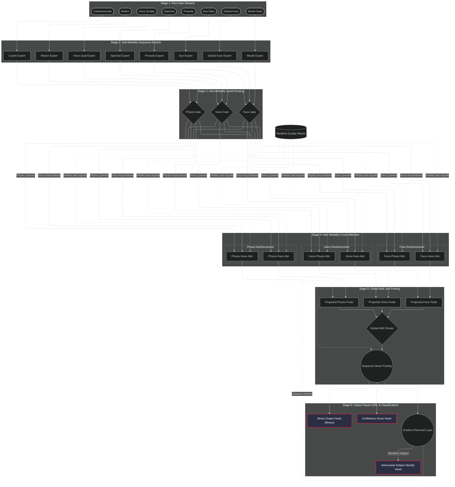
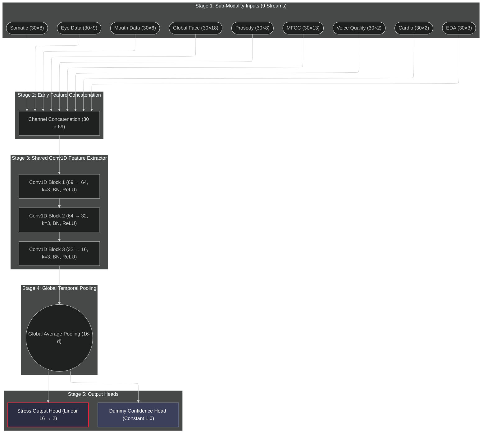
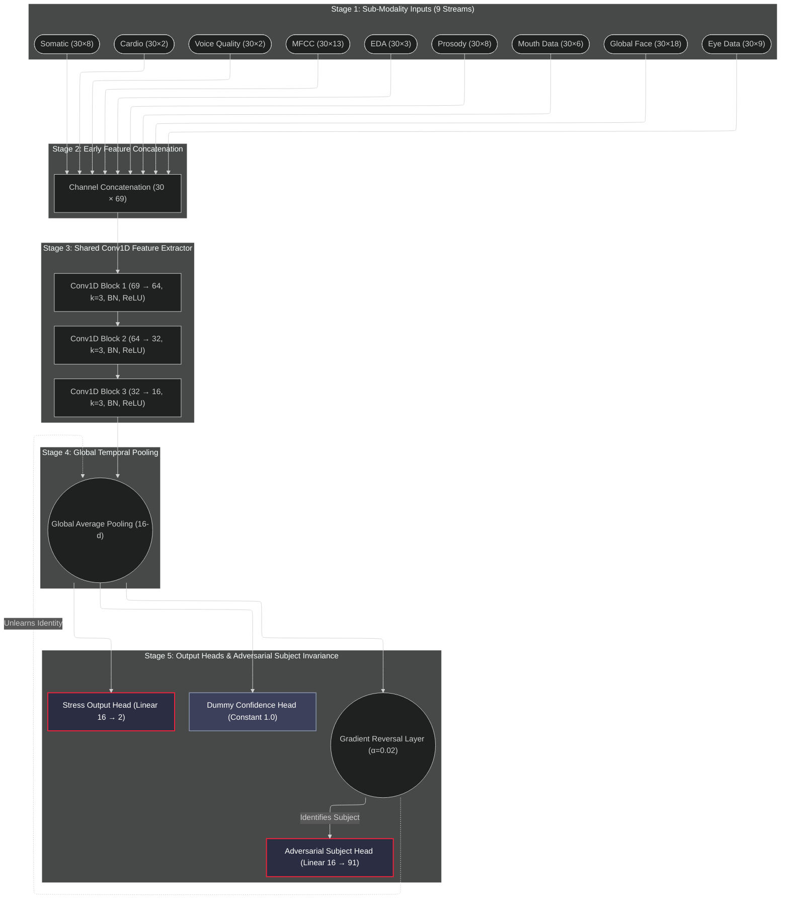
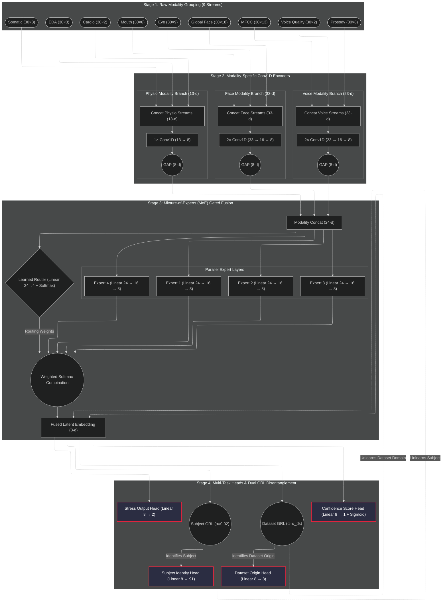

# 4-Model Architecture Comparison

## SSVB-CASA-AIS (41K params)

## CNNBaseline (21K params)

## CNNBaseline+GRL (23K params)

## ConvMoE-MF (8.8K params) — Production Target

---

## Side-by-Side Summary

| Feature | SSVB-CASA-AIS | CNNBaseline | CNNBaseline+GRL | ConvMoE-MF |
|---------|:-------------:|:-----------:|:---------------:|:----------:|
| Params | ~41K | ~21K | ~23K | **8.8K** |
| Encoder | 9× SequenceExpert (Conv1D+Attn+GRU) | 3× Conv1D shared | 3× Conv1D shared | 3× Conv1D modality-specific |
| Fusion | Intra-modality gating + 6× Cross-Attn + 10-expert MoE | Concat + 3× Conv1D | Concat + 3× Conv1D | 4-expert MoE |
| Subject GRL | ✅ α=0.02 | ❌ | ✅ α=0.02 | ✅ α=0.02 |
| Dataset GRL | ❌ | ❌ | ❌ | ✅ α=swept |
| Confidence Head | ✅ | ❌ (dummy) | ❌ (dummy) | ✅ |
| SSL Pretraining | ✅ Contrastive | ❌ | ❌ | ✅ Contrastive |
| Identity Suppression | Subject only | None | Subject only | Subject + Dataset |
