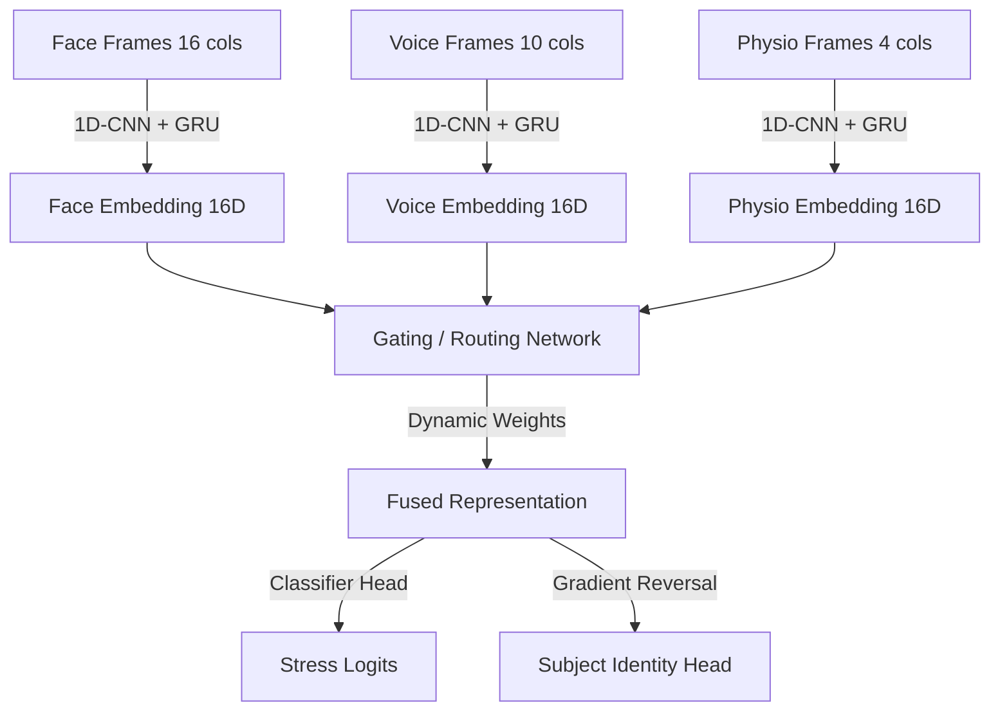

# Formal Architecture Document: Personalized Multimodal Stress Detection System (AVB-MSIA)

This document defines the production and research architecture of the Personalized Multimodal Stress Detection System implemented in this repository.

---

## 📐 Implemented System Architecture

The system utilizes synchronized streams of Face, Voice, and Physiology features at a frame level, executing on NVIDIA CUDA (GPU) to infer the user's stress state while actively suppressing subject-specific biometrics.

---

## 📦 Implemented Layers and Modalities

### 1. Data Loader & Synchronization Contract
*   **Frame-level Alignment**: Face, Voice, and Physio metrics are loaded from `certified_data/` and aligned strictly by `subject_id`, `task_id`, and `window_index`.
*   **Calibration Normalization**: The data loader automatically computes each subject's calm average (label `0` windows) and subtracts it from all features to isolate stress-related delta fluctuations from baseline traits.

### 2. Modality Sequence Encoders
Each modality has a dedicated temporal encoder consisting of:
*   A **1D Convolutional Neural Network (Conv1D)** with kernel size 3 and batch normalization to extract local window-level features.
*   A **Gated Recurrent Unit (GRU)** layer to capture temporal dependencies over the 5-frame sequence length.
*   The last hidden state is extracted as a `16-dimensional` modality embedding.

### 3. Evaluated Fusion Methodologies
We have successfully implemented and evaluated the following fusion strategies:

*   **Early Fusion**: Modality embeddings are concatenated into a single 48-dimensional vector and passed to a Dense classifier.
*   **Gated Fusion**: A gating network dynamically computes a softmax probability distribution representing the reliability/confidence of each modality, summing the weighted embeddings.
*   **Cross-Attention Fusion**: Pairwise Query, Key, and Value matrices learn to align representations across modalities (e.g. Face attending to Voice and Physio) using scaled dot-product attention.
*   **FlexiModal MoE (Mixture of Experts)**: A sparse router selects the Top-k active expert networks based on the sample's representation, interpolating missing streams using a learned trainable parameter bank.

### 4. Adversarial Identity Suppression
To prevent the model from learning subject identity shortcuts (overfitting to individual traits), we integrate:
*   An auxiliary **Subject Classifier Head** that predicts `subject_id` (65 subjects).
*   A **Gradient Reversal Layer (GRL)**. During backpropagation, the gradients flowing from the subject head are scaled by $-\lambda$ (where $\lambda = 0.02$), forcing the sequence encoders to learn subject-independent features.

---

## 📈 Benchmarking Results (5-Fold LOSO GroupKFold)

The table below catalogs the validation accuracy of the different research and production strategies:

| Strategy / Model Configuration | Mean Accuracy | Validation Protocol |
| :--- | :---: | :--- |
| **Strategy 4 (Production Standard)** | **0.6944** | 5-Fold LOSO GroupKFold |
| **Strategy 5 (Production Adversarial)** | **0.7051** | 5-Fold LOSO GroupKFold |
| **Unimodal Voice Expert (Research)** | **0.7153** | 5-Fold LOSO GroupKFold |
| **Unimodal Face Expert (Research)** | **0.6664** | 5-Fold LOSO GroupKFold |
| **Unimodal Physio Expert (Research)** | **0.6466** | 5-Fold LOSO GroupKFold |
| **Gated Fusion Model (Research)** | **0.6765** | 5-Fold LOSO GroupKFold |
| **Early Fusion Model (Research)** | **0.6725** | 5-Fold LOSO GroupKFold |
| **Cross-Attention Fusion (Research)** | **0.6728** | 5-Fold LOSO GroupKFold |
| **Adversarial Hybrid MoE (Research)** | **0.6704** | 5-Fold LOSO GroupKFold |
