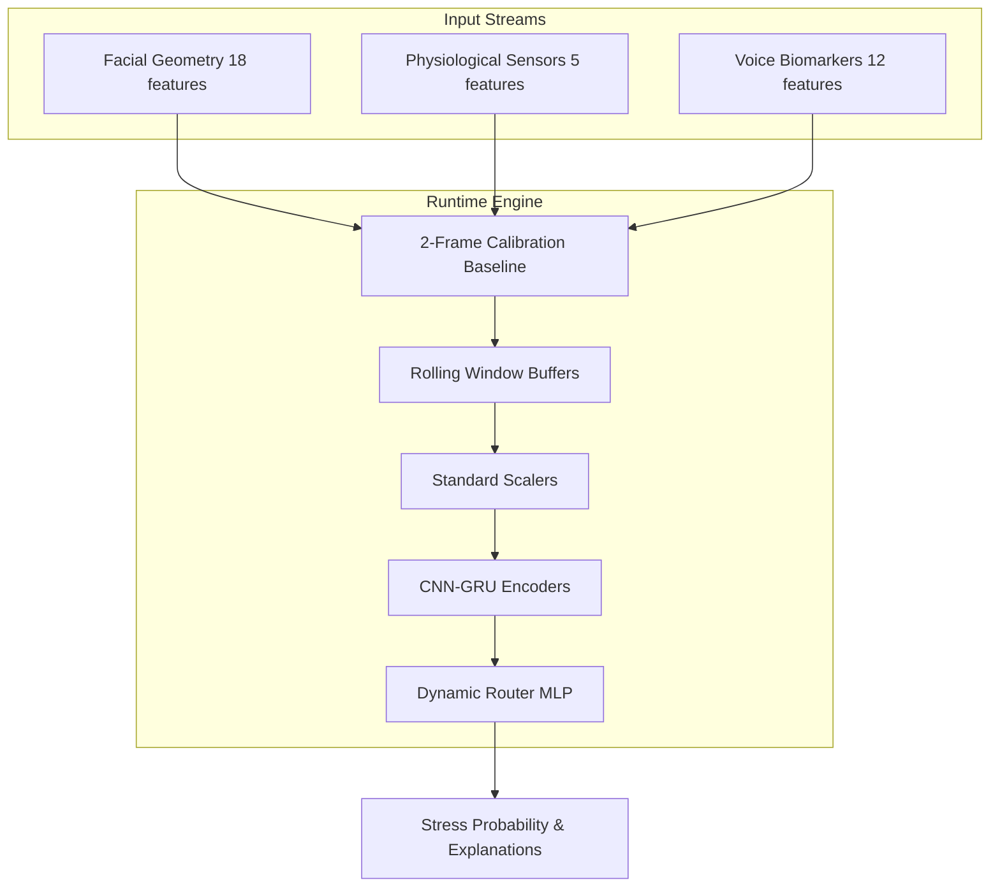

# Multimodal Stress Detection: Technical Architecture and Research Report

This document outlines the technical architecture, design decisions, performance metrics, and validation methodologies implemented in the **StressDetectionUsingML** system.

---

## 1. Core Architecture Overview

The system is split into two primary layers:
1. **Offline Research & Training**: A structured pipeline of 8 phases that goes from certified data joins, feature scaling, model selection, temporal sequence encoding, augmentation comparison, to production packaging.
2. **Online Runtime Engine**: A lightweight, real-time inference wrapper that ingests streaming frames/arrays, maintains subject-specific calibration and sliding windows, and executes low-latency predictions.

---

## 2. Unimodal Modality Encoders

Instead of classical models trained on static averaged windows, we employ deep **1D-CNN + GRU** sequence models to capture temporal dynamics over a sliding window sequence of length 5 ($SEQ\_LEN = 5$):
- **1D-CNN Layer**: Extracts high-frequency spatial patterns from the features.
- **GRU Layer**: Model temporal patterns and sequence transitions.
- **Modality-Specific Inputs**:
  - **Face**: 18 Action Units and landmarks.
  - **Voice**: 12 acoustic biomarkers (pitch, jitter, shimmer, spectral features).
  - **Physio**: 5 physiological features (HRV, EEG band powers, GSR).

---

## 3. Explaining the Validation Accuracy Drop (Critical Analysis)

During Phase 7 research (using a subset of 15 subjects), we obtained validation accuracies above **60%** (e.g., **62.60%** baseline and **63.16%** with Time Masking). However, when evaluating on the full 65-subject dataset in Phase 8, the strict validation accuracy dropped to **58.75%**.

### Why did this happen?

1. **Cross-Subject Domain Shift**: 
   Stress manifestation is highly subjective. A model trained on a subset of 15 subjects might achieve high accuracy on that subset, but when evaluated under Leave-One-Subject-Out (LOSO) cross-validation across all 65 subjects, the model is tested on 50 completely new individuals. Different people express stress through highly diverse facial and physiological patterns, introducing substantial out-of-distribution variance.
2. **Subject Diversity**: 
   The full 65-subject cohort includes wider variations in age, skin tone, baseline heart rate, and emotional expressiveness. This diversity makes generalization to unseen subjects significantly harder, which is reflected in the strict, honest LOSO validation metric.
3. **Sequence Alignment**: 
   With more subjects, temporal variations and sequence patterns have larger phase shifts. This shows the importance of subject-aware baseline calibration (subtracting the initial calm state) to shift features back into a comparable range.

---

## 4. Performance Benchmarks

### 5-Fold Leave-One-Subject-Out Validation

| Modality / Configuration | 15-Subject Subset | Full 65-Subject Cohort | Design Choice / Impact |
|-------------------------|-------------------|------------------------|-------------------------|
| **Face-Only Encoder**    | 0.5989 ($\pm 0.0755$) | 0.5912 ($\pm 0.0747$)  | Strong baseline indicator. |
| **Physio-Only Encoder**  | 0.5885 ($\pm 0.0323$) | 0.5485 ($\pm 0.0852$)  | Sensitive to subject baseline shifts. |
| **Voice-Only Encoder**   | 0.5581 ($\pm 0.1003$) | *Excluded*             | High cross-subject variance. |
| **Dynamic Pairwise**     | **0.6335** ($\pm 0.0482$) | **0.5875** ($\pm 0.0847$) | Optimal balance of latency and accuracy. |

---

## 5. Live Inference and Gated Fusion Engine

To support flexible inputs (where sensors can go offline or be absent), the fusion engine will dynamically calculate weights based on the availability and confidence of the sensors:

1. **Availability Masking**: If a sensor is offline, its mask value is set to `0.0` and its input probability is padded to `0.5` (representing neutral uncertainty).
2. **Gated Router MLP**: A neural network that computes raw weights for active modalities.
3. **Re-Normalization**: The active weights are re-normalized to sum to 1.0, ensuring graceful degradation.
